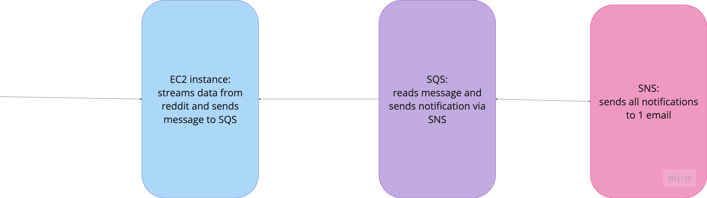

# Reddit Scrapper Application:

## Application:

The application is a python script, run in a docker container on an ec2 instance. 

### Dependency Management:
When there is a new dependency change and the requirements.in is updated, to generate the requirements.txt run:
`pip-compile requirements.in`

### Testing:
1. Fetch reddit secrets and update .env.test TODO: should this just fetch from ssm?

2. Spin up docker services:

   `cd /docker`

   `docker compose up -d`

3. Activate python environment:

   `source venv/bin/activate`

4. Start consumer:

   `python3 test/consumer.py`

4. Start producer (can optionally be started by creating + running the docker container):

   `python3 src/producer.py`

5. Log validation where the consumer is running to ensure that SNS has sent the messages successfully.

#### Improvement:
Generate a mock reddit client, which the producer can read from and can assert that the consumer is getting the exact messages that the producer produced.

## Infrastructure: 

There are 2 folders for the terraform changes. The app folder manages all of the infrastructure related to this application, as shown in the diagram below.

The second folder, iam-role manages the policies used for the role that runs all the above terraform changes. In the future, this will be in a different repo.

### Useful Commands:

In order to log into aws ecr (assuming there is an aws role setup):

`aws ecr get-login-password --region us-east-1 | docker login --username AWS --password-stdin 992382748278.dkr.ecr.us-east-1.amazonaws.com
`

Logging into ec2 instance using the key pair:

`ssh -i "kenzie_key_pair.pem" ec2-user@54.88.128.93`

